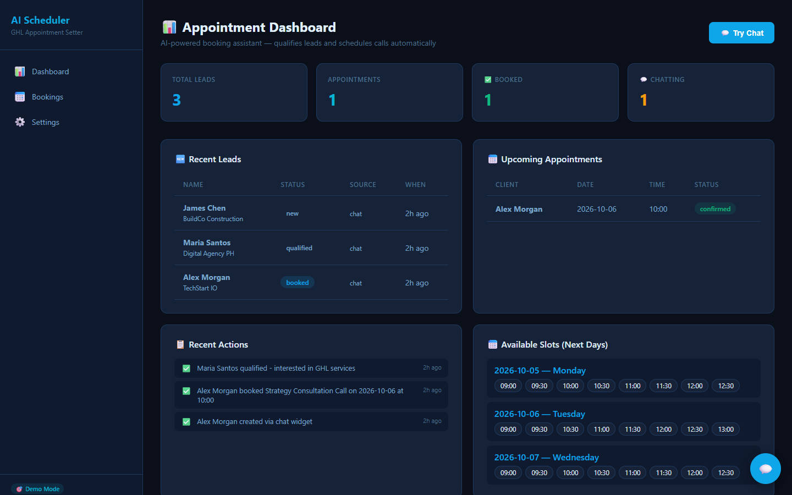
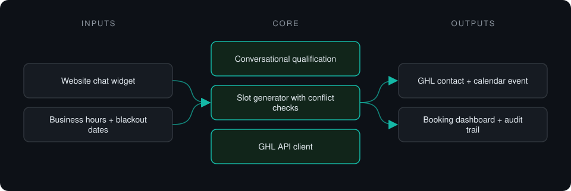
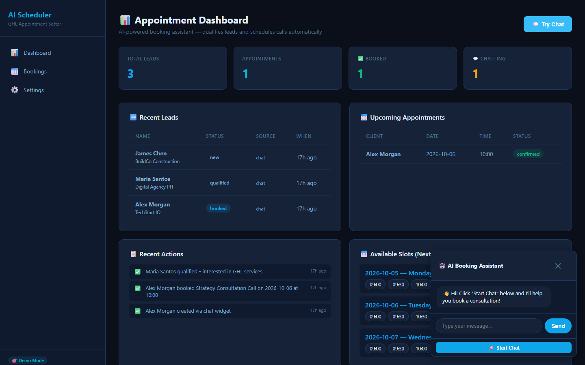

# GHL Appointment Setter

**Chat assistant that qualifies inbound leads, collects contact details and books calls straight into a GoHighLevel calendar.**

> **This is a proprietary project. Source code is private. This page showcases the system's architecture and results.**

**Case study page:** [https://jryahia.github.io/showcase-ghl-appointment-setter/](https://jryahia.github.io/showcase-ghl-appointment-setter/)

## Problem it solves

Inbound leads go cold while waiting for a human to qualify and schedule them. This assistant handles the first conversation, offers real open slots and creates the contact and event in GoHighLevel.

## Architecture

1. A visitor opens the chat widget and answers qualification questions.
2. Available slots are generated from business hours, minus conflicts and blackout dates.
3. The lead picks a slot; the contact and event are created in GoHighLevel.
4. Every conversation and booking is logged.

## Key features

- Conversational booking flow
- Slot generation with conflict and blackout handling
- GoHighLevel contact and calendar integration
- LLM qualification with a rule-based fallback
- Demo mode with mock GHL responses

## Tech stack

     

## What it does in practice

- Covers the first-contact and scheduling step that would otherwise need a human SDR.

## Screenshots

**Leads, upcoming appointments and open slots**

**Booking assistant chat widget**

---

Built by [Yahya Jarray](https://github.com/jryahia). Interested in a similar system? [Get in touch](mailto:yahiajarray43@gmail.com).
